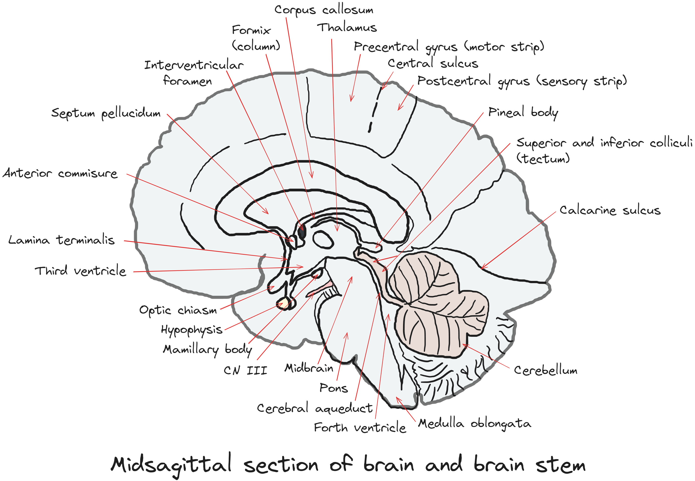

## Lecture 7: Structure of the Nervous System: Neuroanatomy

### References & Credits

-   Fix, J. D. & Brueckner, J. K. (2009). High-Yield Neuroanatomy (4th Ed.) (Chapter 13, Figure 3-1). Lippincott Williams & Wilkins.

