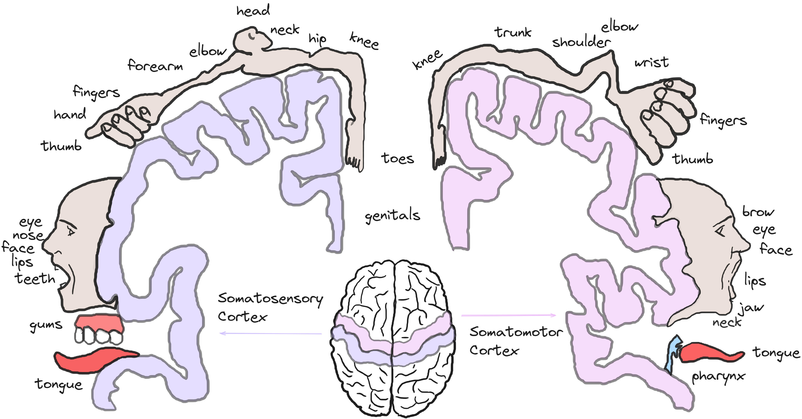

## Lecture 8: Somatosensory and Motor Systems

### References & Credits

-   Encyclopædia Britannica, Inc./Steven N. Kapusta (2023, November 25). Homunculi of the motor cortex and sensory cortex of the human brain. https://www.britannica.com/science/homunculus-biology#/media/1/270724/277135

