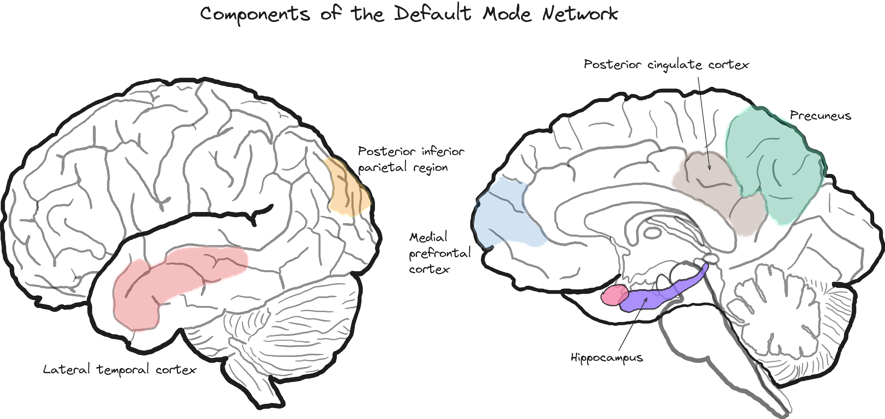

## Lecture 9: The Resting Brain, Attention, and Consciousness 

### References & Credits

-   Ricard, M., Lutz, A., & Davidson, R. J. (2014). Mind of the meditator. Scientific American, 311(5), 38--45. doi: [10.1038/scientificamerican1114-38](10.1038/scientificamerican1114-38)

