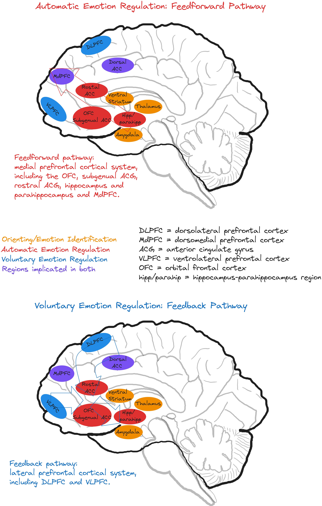

## Lecture 11: Brain Mechanisms of Emotion

### References & Credits

-   Phillips, M. L., Ladouceur, C. D., & Drevets, W. C. (2008). A neural model of voluntary and automatic emotion regulation: implications for understanding the pathophysiology and neurodevelopment of bipolar disorder. Molecular psychiatry, 13(9), 833-857. [https://doi.org/10.1038/mp.2008.65](https://doi.org/10.1038/mp.2008.65)

