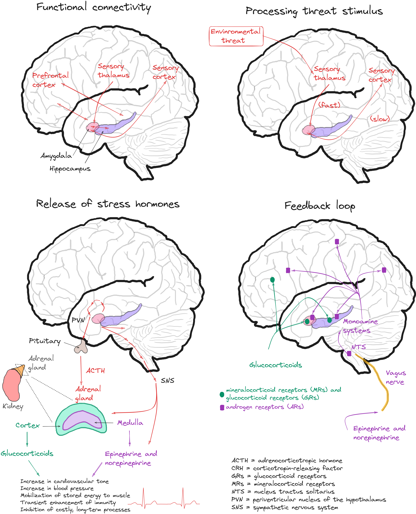

## Lecture 12: Mental Illness

### References & Credits

-   Rodrigues, S. M., LeDoux, J. E., & Sapolsky, R. M. (2009). The influence of stress hormones on fear circuitry. Annual review of neuroscience, 32, 289-313. [https://doi.org/10.1146/annurev.neuro.051508.135620](https://doi.org/10.1146/annurev.neuro.051508.135620)

