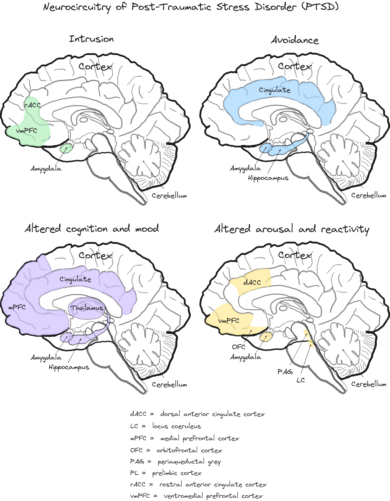

## Lecture 13: Research Domain Criteria (RDoC)

### References & Credits

-   Fenster, R. J., Lebois, L. A., Ressler, K. J., & Suh, J. (2018). Brain circuit dysfunction in post-traumatic stress disorder: from mouse to man. Nature Reviews Neuroscience, 19(9), 535-551. [https://doi.org/10.1038/s41583-018-0039-7](https://doi.org/10.1038/s41583-018-0039-7)

