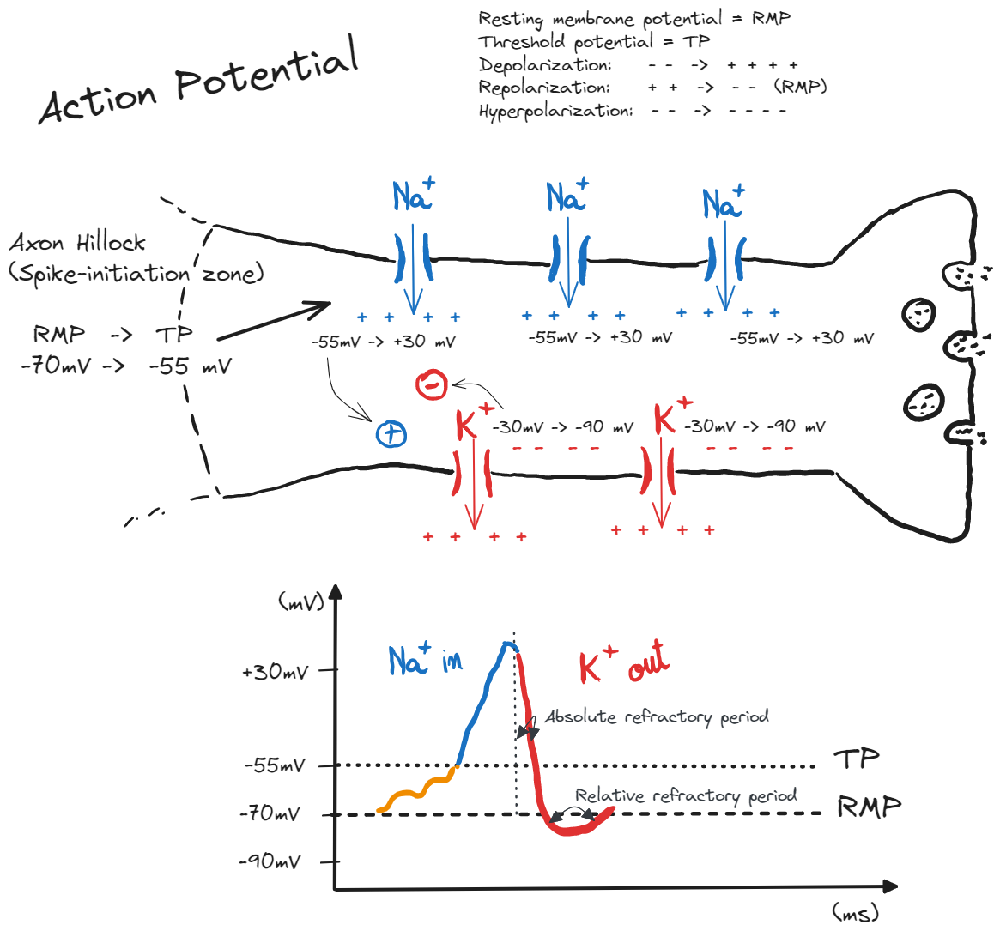

## Lecture 3: The Action Potential

### References & Credits

-   Murphy, Z. (2023, August 15). Ninja Nerd Neurology lecture: “Resting Membrane, Graded, Action Potentials”. https://www.ninjanerd.org/lecture-category/neurology

