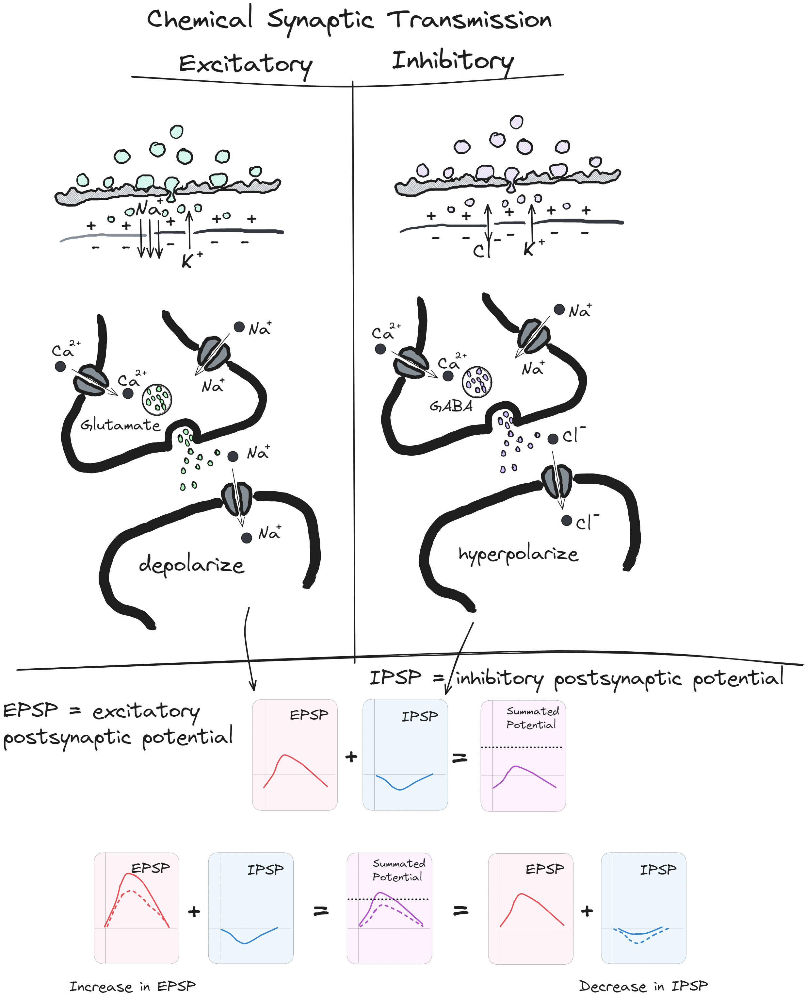

## Lecture 4: Synaptic Transmission

### References & Credits

-   Felten, D. L., Maida, M. S., & Netter, F. H. (2019). Netter's neuroscience coloring book (plate 1.12). Elsevier.

-   Felten, D.L., O'Banion, M.K. & Maida, M.S. (2022). Netter's atlas of neuroscience (4th Edition). Elsevier.

