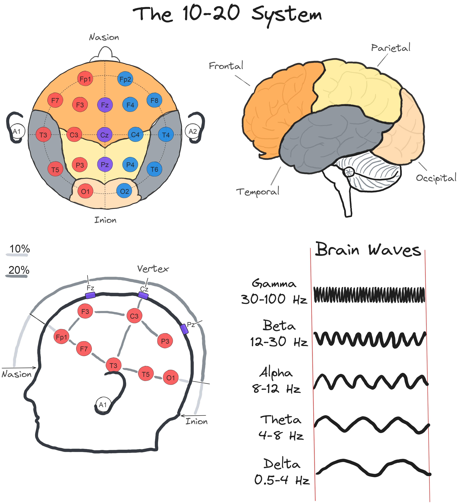

## Lecture 5: Peripheral Electrophysiology and the Electroencephalogram

### References & Credits

-   Electrode arrangement according to the international 10/20 system. https://www.ternimed.de/useful-information/Electrode-arrangement-according-to-the-international-10/20-system

