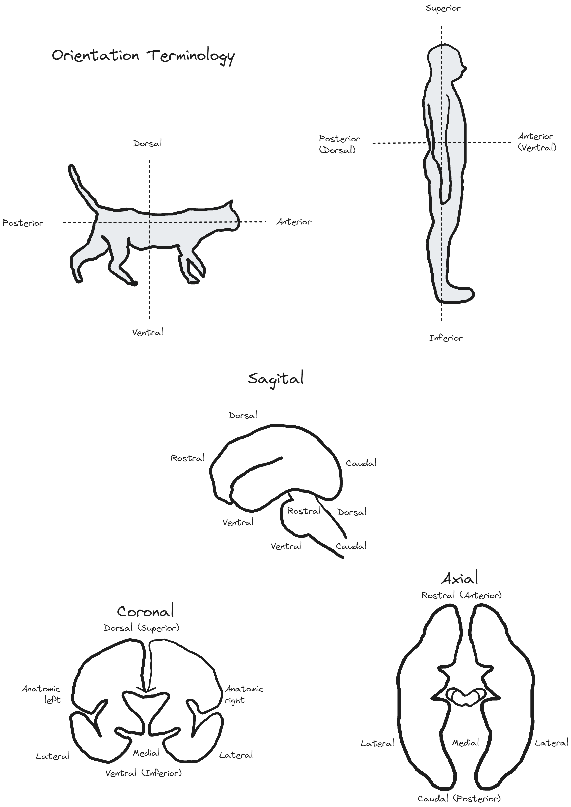

## Orientation terminology

### References & Credits

-   Fisch, A. (2012). Neuroanatomy: Draw it to Know it (p. 9). Oxford University Press.
-   LeDoux, J. (2019). The Deep History of Ourselves: The Four-Billion-Year Story of How We Got Conscious Brains (p. 147). Penguin Random House.

