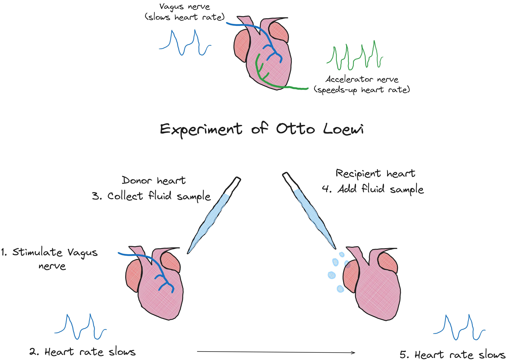

## Otto Loewi's experiment led to discovery of the first neurotransmitter - acetylcholine

### References & Credits

-   Başar, E. (2010). Why the Concept of "Quantum Brain"" was not Discovered in 1940s. NeuroQuantology, 8(3). doi:10.14704/nq.2010.8.3.332
-   https://en.wikipedia.org/wiki/File:Vagusstoff2.png

