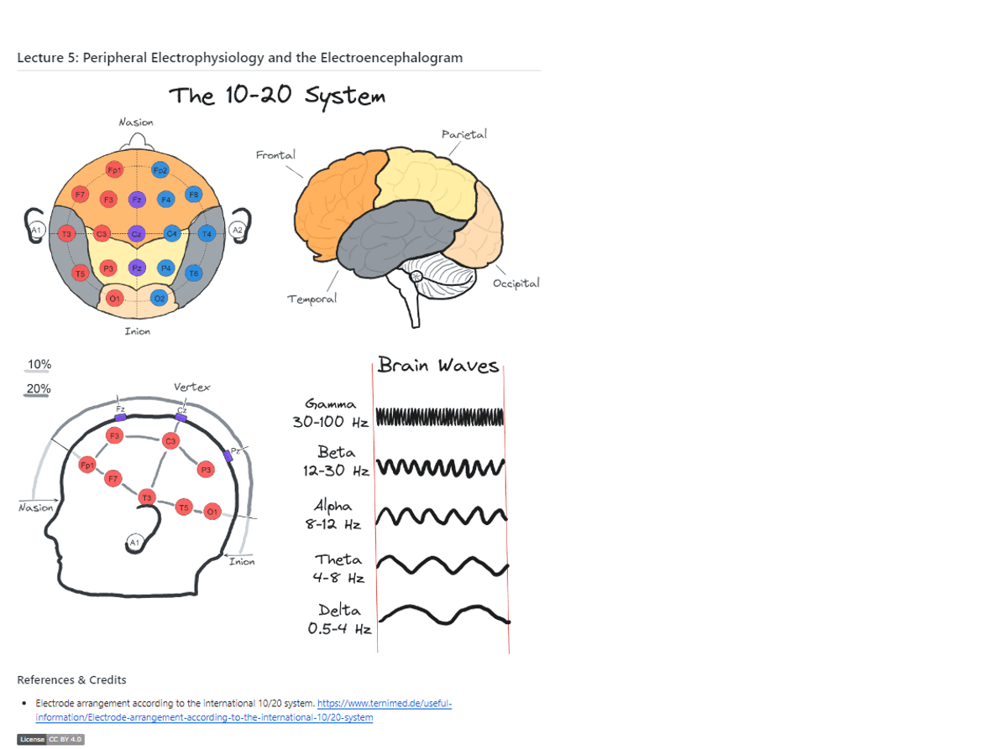

# DrawMeABrain

> 'Please ... could you draw me a *brain*?' he repeated slowly, with care, as if this was a matter of great importance. [..] it struck me that my studies had been centred around geography, history, arithmetic, and grammar, and I told the little man (with some irritation) that I did not know how to draw. He answered, 'No matter. Draw me a *brain*.'
>
> If anybody wants a *brain*, that is a proof that he exists.
>
> \~ The Little Prince

## Raison d'être

The brain is frequently described by us, its owners, as the most complex object in the universe. This is most probably a gross exaggeration, but serves a cute excuse for our very limited understanding of it.

Drawing brains is a playful, unpretentious, and charming way to help our brains learn more about themselves.

Either digitally or the old fashioned way - draw along to consolidate your learning!

## Contributions

Suggestions and ideas are welcome. You can also contribute your own drawings as `.excalidraw` files for [Excalidraw](https://excalidraw.com/). 

